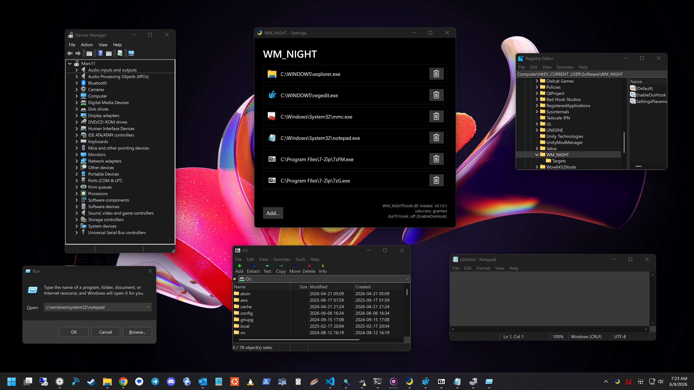

# WM_NIGHT

> Native dark mode for the classic Win32 desktop — Explorer, Regedit, the Control Panel, the Explorer Run dialog, and the things Windows - and other developers - forgot.

<p align="center">
  
</p>

## What it is

WM_NIGHT is a tray app that paints Windows' leftover light-mode corners dark. The OS shipped a dark theme years ago but never finished the job: regedit, the Control Panel, and a long tail of classic dialogs still blast you with white. WM_NIGHT injects [umbra](https://github.com/martona/WM_UMBRA)'s dark-mode engine into those processes and themes them at the source.

It's two pieces:

- **`WM_NIGHT.exe`** - a tray host. Installs one global hook and registers itself to run at login.
- **`WM_NIGHThook.dll`** - the payload. Windows maps it into GUI processes as they start; it's inert everywhere except the apps you've whitelisted, where it does the theming.

Out of the box it themes **Explorer** and **regedit** near-perfectly and the **Control Panel** reasonably well. WinForms-heavy surfaces and most **MMC** snap-ins are a mixed bag - that's the current wall. You can add any leftover
forgotten win32 app you like to the whitelist, chances are it will work. (7-Zip, Spyxx, etc.) Heavily owner-drawn stuff will probably produce an unsightly abomination, but feel free to experiment. The target apps should be native Win32/MFC; C#-suff (WinForms) is almost certain to not work.

## How it works

- The host installs a single global **`WH_CBT`** hook. The OS maps the payload into each GUI process as its windows are created, so WM_NIGHT catches an app no matter how it was launched.
- The payload checks each process against a **registry whitelist** (`HKCU\Software\WM_NIGHT\Targets`; defaults to Explorer + regedit). Outside the whitelist it loads and does nothing.
- In a target it initializes umbra and installs **[Detours](https://github.com/microsoft/Detours)** inline hooks on the color/theme entry points: `GetSysColor`, the uxtheme drawing calls, and - optionally - DirectUI's `Element::PaintBackground`, then themes every window as it's created.
- **uiAccess**: a signed host launched from a trusted location can theme elevated targets without running elevated.
- Exiting the app will bounce Explorer; that's on purpose.
- Should you get into a crash loop when Explorer starts, hold down SHIFT to prevent WM_NIGHT from loading. I haven't had a single crash even while developing the app, but it's a big world out there.

## Downloads

Grab the latest signed release — no installer required.

|  | x64 (amd64) | ARM64 |
|---|---|---|
| **Loose (.zip)** | [WM_NIGHT-windows-amd64.zip](https://github.com/martona/WM_NIGHT/releases/latest/download/WM_NIGHT-windows-amd64.zip) | [WM_NIGHT-windows-arm64.zip](https://github.com/martona/WM_NIGHT/releases/latest/download/WM_NIGHT-windows-arm64.zip) |
| **MSIX** | [WM_NIGHT-windows-amd64.msix](https://github.com/martona/WM_NIGHT/releases/latest/download/WM_NIGHT-windows-amd64.msix) | [WM_NIGHT-windows-arm64.msix](https://github.com/martona/WM_NIGHT/releases/latest/download/WM_NIGHT-windows-arm64.msix) |

Unzip and run `WM_NIGHT.exe`; it drops to the tray and starts theming. To also theme **elevated** windows (an elevated regedit or mmc), install the **MSIX** or run the signed exe from a trusted location like `Program Files`. Windows only honors uiAccess from there.

Every build is signed (Azure Trusted Signing) and carries a build-provenance attestation so you know it was built from source on github. Matching PDBs ride along on each release as `WM_NIGHT-<version>-windows-<arch>-symbols.zip`. Browse all releases [here](https://github.com/martona/WM_NIGHT/releases).

## Building

Requires **Visual Studio 2022** (the v143 C++ toolset + the Windows 10/11 SDK) and **vcpkg**. Dependencies come through vcpkg manifest mode (static triplet): **Detours** from the default registry and **umbra** from the public [WM_UMBRA](https://github.com/martona/WM_UMBRA) vcpkg registry.

```powershell
# one-time: wire vcpkg into MSBuild
vcpkg integrate install

# build (Platform: x64 or ARM64; Configuration: Debug or Release)
msbuild WM_NIGHT.sln /m /p:Configuration=Release /p:Platform=x64
```

Output lands in `build\<Config>\<Platform>\` — `WM_NIGHT.exe` and `WM_NIGHThook.dll` side by side. A plain build is unsigned and themes non-elevated targets fine; uiAccess for elevated targets only kicks in once signing is configured (see Releasing). The MSIX is produced by `scripts\package_windows_msix.ps1` (used by the release pipeline; it derives the package publisher from the signed exe, so pass `-NoSign -Publisher "CN=…"` for a local unsigned package).

## Releasing

The version lives in **`src/version.h`** (the four `WMN_VERSION_*` macros plus the matching `WMN_VERSION_STR`). To cut a release:

1. Bump `src/version.h` and commit.
2. Tag and push:
   ```powershell
   git tag v0.1.0.0
   git push origin v0.1.0.0
   ```

GitHub Actions builds amd64 + ARM64, signs everything, attaches the loose zip + MSIX + symbols, attests provenance, and opens a **draft** release. Review it, then Publish (or `gh release edit --draft=false v0.1.0.0`). The pipeline refuses a tag that doesn't match `version.h` and fails if `WMN_VERSION_STR` drifts from the numeric macros.

Alternatively, run **Release (manual)** from the Actions tab (it reads `version.h`; tick *publish* to skip the draft). Every push and PR also runs **Windows CI**, which builds both arches and asserts the binaries pull in no VC++ runtime DLLs.

## Contributing

Issues and PRs welcome.

This is a personal, non-commercial project. Copyright (C) 2026 [Marton Anka](https://anka.me)